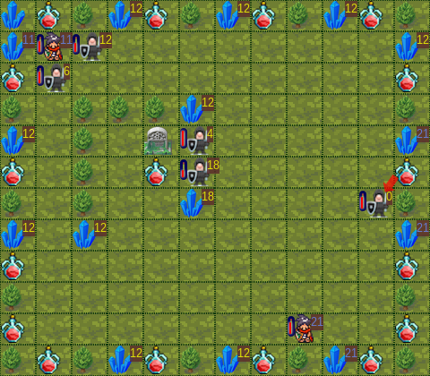

Battle #3
=========

**The paladin** has born

```js
/**
 * Paladin
 *
 * A mix of priest and careful assasin
 *
 * It tries to heal teammates while keeping himself healthy, but if he has a
 * chance to kill, he does
 */

var paladin = function (gameData, helpers) {
  var myHero = gameData.activeHero;

  // keep yourself healthy

  if (myHero.health <= 60) { return helpers.findNearestHealthWell(gameData); }

  // kill affordable enemies

  var adjacentEnemy = helpers.getAdjacentWeakestEnemy(gameData);

  if (adjacentEnemy && adjacentEnemy.tile.health < 30) {
    return adjacentEnemy.direction;
  }

  // heal affordable team members

  var adjacentTeamMember = helpers.getAdjacentWeakestTeamMember(gameData);

  if (adjacentTeamMember &&
      adjacentTeamMember.tile.health < (myHero.health - 40)) {
    return adjacentTeamMember.direction;
  }

  // default to careful assassin

  return helpers.findNearestWeakerEnemy(gameData);
};
```

Here I have priorized to be healthy due to the fast death in the previous battle (turn #287) killed by a
**safe diamond miner**

The good
--------

*   We win!
*   I have survived!
*   I kill 4 enemies!

The bad
-------

Nothing at all. I'm quite satisfied with this battle besides some known issues

Notes
-----

### A hero dies with `health: 0`

I was wrong assuming that a hero is dead with `health < 0`

Some algorithms needs to be tweaked here

### A health well gives 30 life points

I have a bug, where I'm going to heal myself with `health <= 60` where it needs to be
`health <= 70` although maybe this is a too high threshold

### Heal yourself to maximum health

I have noted that when the hero has `health < 100` he is undecided about the choice of their target, because it starts
to find an enemy but if the enemy heal himself the hero choses another enemy and so on

To fix this behavior is needed to have `health: 100` as the `findNearbyWeakerEnemy()` will return the nearest enemy
regardless of the enemy's health

### Fix `findNearestWeakerEnemy()` behavior

When the are severar enemies weaker than the hero and at the same distance, the algorithm choses one of them at
random

It needs to get fixed in order to choose the weakest one

### Same board?

The board seems to be the same in every battle, so in order to verify this I'm going to capture it in a image for
further comparissons



### Verified: `findNearestObject` returns `distance = 1` with adjacent objects

To demonstrate this, I have created a little shell script which has searched for "distance" output of
`test_your_hero_code.js` node script provided by the hero-starter repo

The distance has been logged by a function which only logs a distance value when an enemy has `health <= 20` and it is
at `distance = 2` which I have been assumed that is when there is just one move needed to be in an adjacent position

Here is the shell script:

```bash
until grep 'distance [^u]' foo.tmp
do node test_your_hero_code.js > foo.tmp
done
```

And here is the important bits of a generated `foo.tmp` log:

```
...

-----
Turn 13:
-----
Enemy tried to move South
Enemy owns 1 diamond mines
Enemy has 10 health
|---|---|---|---|---|
|   |   |   |   |   |
|---|---|---|---|---|
|   |   |   |   |   |
|---|---|---|---|---|
|   |D00|WWW|D01|H00|
|---|---|---|---|---|
|   |   |   |   |   |
|---|---|---|---|---|
|   |   |   |   |H01|
|---|---|---|---|---|
********
distance 2
-----
Turn 14:
-----
MyHero tried to move South
MyHero owns 0 diamond mines
MyHero has 80 health
|---|---|---|---|---|
|   |   |   |   |   |
|---|---|---|---|---|
|   |   |   |   |   |
|---|---|---|---|---|
|   |D00|WWW|D01|   |
|---|---|---|---|---|
|   |   |   |   |H00|
|---|---|---|---|---|
|   |   |   |   |   |
|---|---|---|---|---|
********
```
